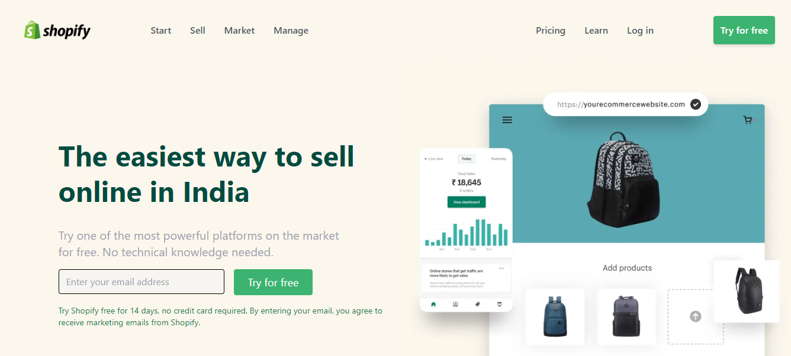

# Shopify Clone using Tailwind CSS

> This web page is a clone of popular shoping website **"Shopify"**
>
> This web page is designed with Tailwind CSS as it provides us feature rich classes and enables us to build web pages rapidly
>
> You can find the preview and live deployment link of the website below
>
>
> # [Live Deployment Link](https://rajshopifyclone.netlify.app/)

# Preview

### Concepts used while building this web page

1. Stciky position
2. Flex box
3. Grid
4. Positing Images and Videos
5. Padding and Margin
6. Using icons provided by third part websites
7. Styling buttons

 

# It took around 10 hours to design this web page
